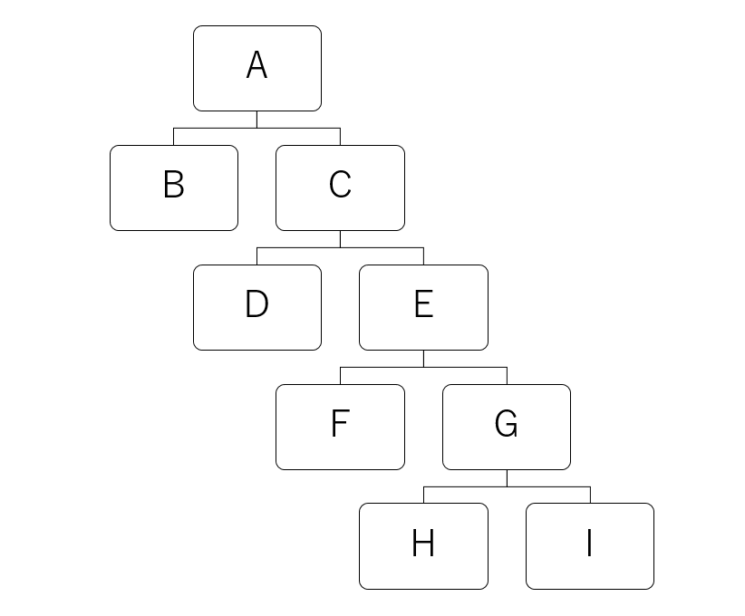

# sql-cheat-sheet

## Deadlock Survey Methods
Check the number of locks occurring.
```sql
SELECT trx_rows_locked FROM information_schema.INNODB_TRX;
```

Check the number of locks occurring and the thread ID.  
row lock(s): Number of locks occurring.  
MySQL thread id: ID of the thread in which the lock is occurring *thread id is the same as the Id in show processlist;.
```sql
SHOW ENGINE INNODB STATUS\G;
```

## Transaction isolation level confirmation
```sql
SELECT @@GLOBAL.tx_isolation, @@tx_isolation;
-- +-----------------------+-----------------+
-- | @@GLOBAL.tx_isolation | @@tx_isolation  |
-- +-----------------------+-----------------+
-- | REPEATABLE-READ       | REPEATABLE-READ |
-- +-----------------------+-----------------+
```

## Dump
Dump only DDL:
```sh
mysqldump \
  -h <host_name> \
  -u <user_name> \
  -p<password> \
  -B <db_name> \
  -d | sed 's/ AUTO_INCREMENT=[0-9]*\b//'
```

DDL and dump data:
```sh
mysqldump \
  -h <host_name> \
  -u <user_name> \
  -p<password> \
  --skip-comments \
  <db_name>
```

Dump data from a specific table:
```sh
mysqldump \
  -h <host_name> \
  -u <user_name> \
  -p<password> \
  --no-create-info \
  --complete-insert \
  <db_name> \
  --where "id=1" <table>
```

## Calendar
```sql
SET @month = '202210';
SELECT
  td.date
FROM
  (SELECT
    date_add(CONCAT(@month, '01'), interval td.0 day) date
  FROM
    (VALUES (0), (1), (2), (3), (4), (5), (6), (7), (8), (9), (10),
            (11), (12), (13), (14), (15), (16), (17), (18), (19), (20),
            (21), (22), (23), (24), (25), (26), (27), (28), (29), (30)
    ) td
  ) td
WHERE 
  DATE_FORMAT(td.date, '%Y%m') = @month;
-- +------------+
-- | date       |
-- +------------+
-- | 2022-10-01 |
-- ...
-- | 2022-10-31 |
-- +------------+
```

## Get the largest record in the same group
Create sample tables.
```sql
DROP TABLE IF EXISTS sample;
CREATE TABLE sample (
  id int(10) unsigned NOT NULL AUTO_INCREMENT,
  cat enum('a', 'b', 'c') NOT NULL,
  createAt datetime NOT NULL,
  PRIMARY KEY (id)
) ENGINE=InnoDB DEFAULT CHARSET=utf8mb4;

INSERT INTO sample(cat, createAt) VALUES
  ('a', '2022-01-01 00:00:00'),
  ('a', '2022-01-02 00:00:00'),
  ('a', '2022-01-03 00:00:00'),
  ('b', '2022-02-01 00:00:00'),
  ('b', '2022-02-02 00:00:00'),
  ('b', '2022-02-03 00:00:00'),
  ('c', '2022-03-02 00:00:00'),
  ('c', '2022-03-03 00:00:00');
```

Get the record with the largest date in the group.  
If we change our mindset and consider the concept of "largest" to be "no record larger than the corresponding record," we can write the following.
```sql
SELECT * FROM sample t1 WHERE NOT EXISTS (SELECT 1 FROM sample t2 WHERE t1.cat = t2.cat AND t1.createAt < t2.createAt);
-- +----+-----+---------------------+
-- | id | cat | createAt            |
-- +----+-----+---------------------+
-- |  3 | a   | 2022-01-03 00:00:00 |
-- |  6 | b   | 2022-02-03 00:00:00 |
-- |  8 | c   | 2022-03-03 00:00:00 |
-- +----+-----+---------------------+
```

Alternatively, the correct data can be obtained by finding the record with the largest value in a subquery and matching it against it.  
```sql
SELECT * FROM sample t1 WHERE createAt = (SELECT MAX(createAt) FROM sample t2 WHERE t1.cat = t2.cat);
-- +----+-----+---------------------+
-- | id | cat | createAt            |
-- +----+-----+---------------------+
-- |  3 | a   | 2022-01-03 00:00:00 |
-- |  6 | b   | 2022-02-03 00:00:00 |
-- |  8 | c   | 2022-03-03 00:00:00 |
-- +----+-----+---------------------+
```

## Get the number of records per ID in another table linked by ID
```sql
SELECT
  parent.id,
  COALESCE(child.cnt, 0) cnt
FROM
  parent
  LEFT JOIN(SELECT parentId, COUNT(*) cnt FROM child GROUP BY parentId) child ON parent.id = child.parentId;
```

## Check the size (megabytes) of each DB
```sql
SELECT 
  table_schema, sum(data_length) / 1024 / 1024 size
FROM 
  information_schema.tables  
WHERE
  table_schema NOT IN('mysql', 'information_schema', 'performance_schema')
GROUP BY 
  table_schema
ORDER BY
  SUM(data_length+index_length) DESC;
-- +----------------------------+------------+
-- | table_schema               | size       |
-- +----------------------------+------------+
-- | sample                     | 0.04687500 |
-- +----------------------------+------------+
```

## Check the number of records and size (megabytes) of each table
```sql
SELECT
  table_name,
  table_rows numberOfRecords,
  avg_row_length averageRecordLength,
  (data_length+index_length) / 1024 / 1024 totalSize,
  data_length / 1024 / 1024 dataSize,
  index_length / 1024 / 1024 indexSize
FROM 
  information_schema.tables
WHERE
  table_schema=database()
ORDER BY
  (data_length+index_length) DESC;
-- +------------+-----------------+---------------------+------------+------------+------------+
-- | table_name | numberOfRecords | averageRecordLength | totalSize  | dataSize   | indexSize  |
-- +------------+-----------------+---------------------+------------+------------+------------+
-- | sample     |               8 |                2048 | 0.01562500 | 0.01562500 | 0.00000000 |
-- +------------+-----------------+---------------------+------------+------------+------------+
```

## Delete records created one month ago
```sql
DELETE FROM sample WHERE createAt < DATE_SUB(CURDATE(), INTERVAL 1 MONTH);
```

## Find the parent or children of a tree structure recursively


Create tree data with the same contents as above.
```sql
CREATE TABLE tree (
  id CHAR(1) NOT NULL PRIMARY KEY,
  parent CHAR(1)
);

INSERT INTO tree VALUES
  ('A', null),
  ('B', 'A'),
  ('C', 'A'),
  ('D', 'C'),
  ('E', 'C'),
  ('F', 'E'),
  ('G', 'E'),
  ('H', 'G'),
  ('I', 'G');
```

A query tracing the ancestry of 'I'.
```sql
WITH RECURSIVE ancestor(depth, id, parent) AS (
  SELECT 0, tree.id, tree.parent FROM tree WHERE tree.id = 'I'
  UNION ALL
  SELECT ancestor.depth + 1, tree.id, tree.parent FROM ancestor, tree WHERE ancestor.parent = tree.id
)
SELECT depth, id FROM ancestor ORDER BY depth;
+-------+------+
| depth | id   |
+-------+------+
|     0 | I    |
|     1 | G    |
|     2 | E    |
|     3 | C    |
|     4 | A    |
+-------+------+
```

Query to get the children of 'C'.
```sql
WITH RECURSIVE child (depth, id, parent) AS (
  SELECT 0, tree.id, tree.parent FROM tree WHERE tree.id = 'C'
  UNION ALL
  SELECT child.depth + 1, tree.id, tree.parent FROM tree, child WHERE tree.parent = child.id
)
SELECT depth, id FROM child ORDER BY depth;
+-------+------+
| depth | id   |
+-------+------+
|     0 | C    |
|     1 | D    |
|     1 | E    |
|     2 | F    |
|     2 | G    |
|     3 | H    |
|     3 | I    |
+-------+------+
```
